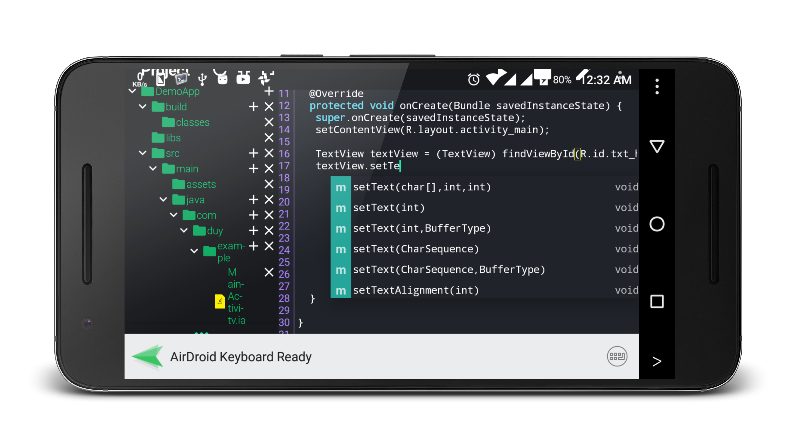

# Java N-IDE Java compiler on Android.

## Overview
This project is develop to help the community learn java on android.
You can build and run Java file with JDK 1.7.

Download in Google Play Store

## Todo
1. Java compiler JDK 1.7 &#10004;
2. Java editor &#10004;
3. Java auto complete code &#10004; (But not working perfect)
4. Java debugger (jdb).
5. Run java file, class file &#10004;
6. Build java library &#10004;
7. Support VCS
8. Decompile class, jar
9. Java code formatter (Google Java code formatter) &#10004;
10. Build Android app. &#10004;
11. XML auto complete
12. Layout builder for Android
13. Android Logcat &#10004;
14. Android debugger

## What does tools the project include?
1. Javac - Java compiler (module javacompiler)
2. Aapt - Android asset package tool
3. Dx - Dex for dalvik VM (module dx)
4. Zip Signer
5. Apk builder

## How to build this source
1. Required Android Studio 3.0 and above
2. Android NDK r12b (Newer version doesn't work)
https://stackoverflow.com/questions/6849981/where-do-i-find-old-versions-of-android-ndk
3. Android Build Tools 27.0.1
4. Android SDK 27

## Contribute
I would absolutely love every possible kind of contributions. If you
have a questions, ideas, need help or want to propose a change just open
an issue. Pull request are greatly appreciated.

## Tutorials
1. Create and build simple java project https://github.com/tranleduy2000/javaide/wiki/Create-simple-Java-project
2. Open Java examples
1. Build java file with library https://youtu.be/fUFqR8ZlChg
3. Build simple Android app https://youtu.be/euZilR8-EhA

## GNU GPL 3.0 Licence

    Copyright (C) 2017-2018 Duy Tran Le

    This program is free software: you can redistribute it and/or modify
    it under the terms of the GNU General Public License as published by
    the Free Software Foundation, either version 3 of the License, or
    (at your option) any later version.

    This program is distributed in the hope that it will be useful,
    but WITHOUT ANY WARRANTY; without even the implied warranty of
    MERCHANTABILITY or FITNESS FOR A PARTICULAR PURPOSE.  See the
    GNU General Public License for more details.

    You should have received a copy of the GNU General Public License
    along with this program.  If not, see <https://www.gnu.org/licenses/>.

