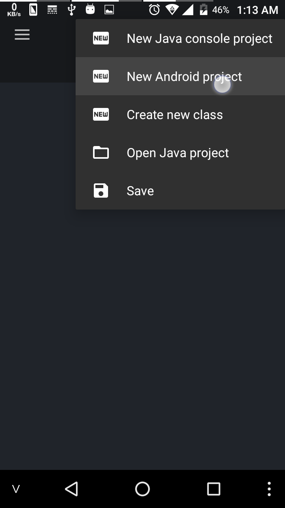
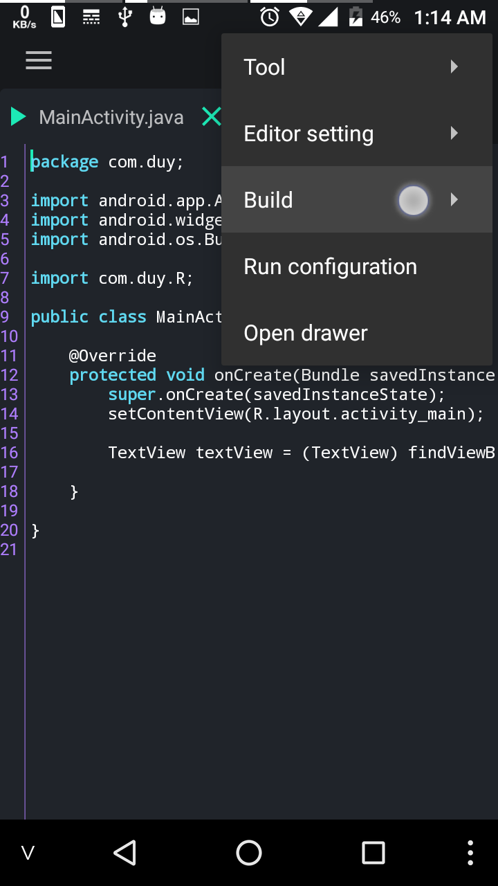
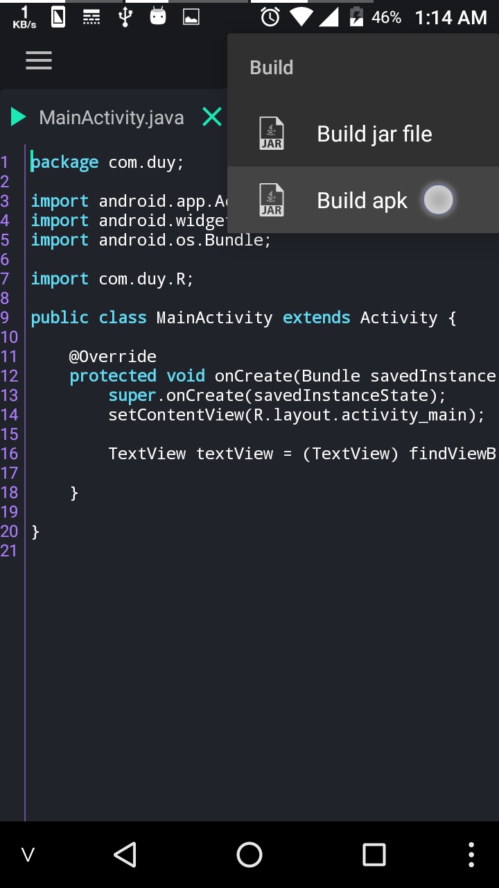
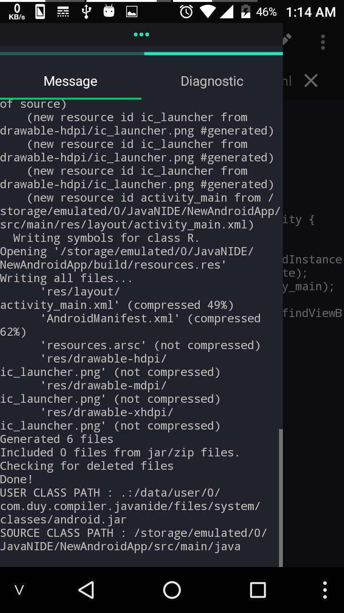

## The Android Project
    AppName/
        build/
            Contains build outputs.
        libs/
            Contains private libraries.
        src/
            Contains all code and resource files for the module in the following subdirectories:
            main/
                Contains the "main" sourceset files: the Android code and resources shared by all build variants (files for other build variants reside in sibling directories, such as src/debug/ for the debug build type).
                AndroidManifest.xml
                    Describes the nature of the application and each of its components. For more information, see the AndroidManifest.xml documentation.
                java/
                    Contains Java code sources.
                res/
                    Contains application resources, such as drawable files, layout files, and UI string. See Application Resources for more information.
                assets/
                    Contains file that should be compiled into an .apk file as-is. You can navigate this directory in the same way as a typical file system using URIs and read files as a stream of bytes using the AssetManager . For example, this is a good location for textures and game data.

## Create new android project with Java N-IDE
1. Select menu "Create new Android project"

2. Enter name of project, package name, main activity, layout main

3. Press OK, you can see Android project structure

## Build apk
1. Select menu Build

2. Select Build apk

3. See compile message

4. Install your apk. find apk in build/output

5. Select and install

